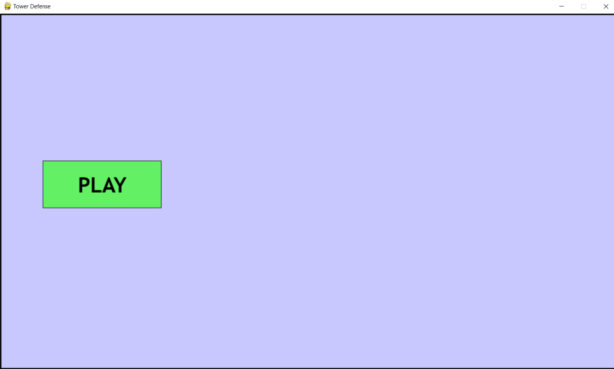
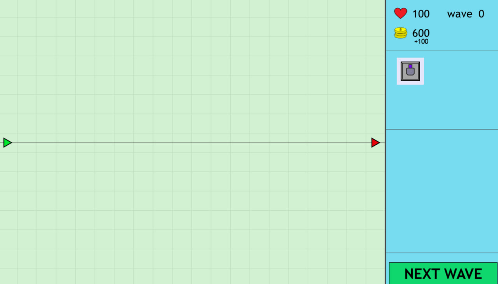
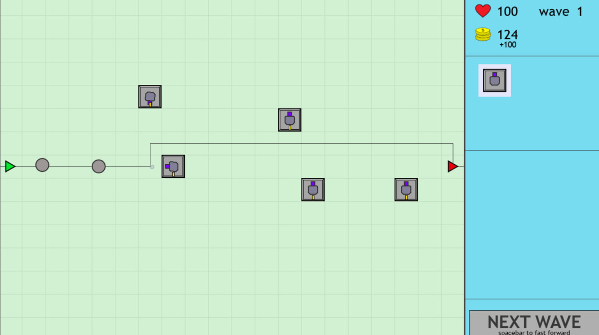

# Tower Defense Game

## Проєкт умовно складається з чотирьох частин

1. **Проєктування**
   - Розробка концептуальної ідеї гри.
   - Дизайн мапи та візуальних елементів.
   - Створення логіки хвиль ворогів.

2. **Ігровий рушій**
   - Реалізація рушія на базі `Pygame`.
   - Взаємодія між ворогами, вежами та гравцем.
   - Візуалізація графіки та анімацій.

3. **Розробка контенту**
   - Створення спрайтів веж, ворогів і мапи.
   - Підготовка даних хвиль ворогів.

4. **Розробка ігрових механік**
   - Реалізація системи розміщення веж.
   - Алгоритми атаки веж.
   - Налаштування складності хвиль.

## Як грати

1. **Запустіть гру**: Розпочніть гру через головне меню.
2. **Розміщуйте вежі**: Використовуйте ігрову валюту для розміщення веж у стратегічних місцях на карті.
3. **Переживайте хвилі**: Перемагайте ворогів у кожній хвилі, щоб перейти до наступної.
4. **Переходьте до нових хвиль**: Натисніть кнопку `Next Wave`, щоб почати наступну хвилю ворогів.

## Майбутні плани

- Додати більше типів веж із унікальними можливостями.
- Впровадити спеціальні хвилі з босами для додаткових викликів.

## Requirements

- **Python**: Version 3.12 or higher.
- **Pygame**: Version 2.6.1 or higher.

## Setup

1. Clone this repository to your local machine.
2. Run main.py

## Images

